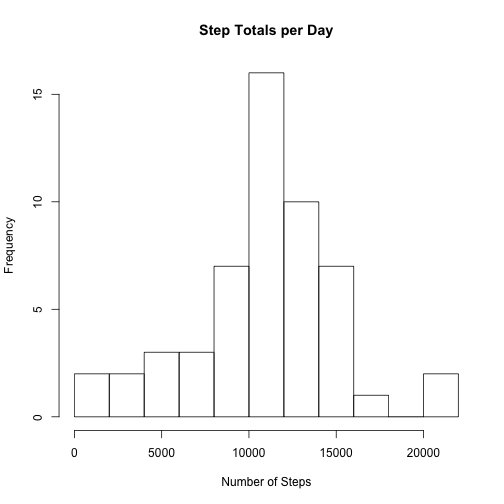
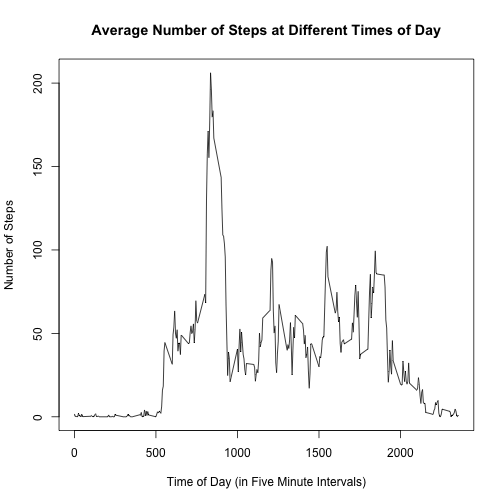
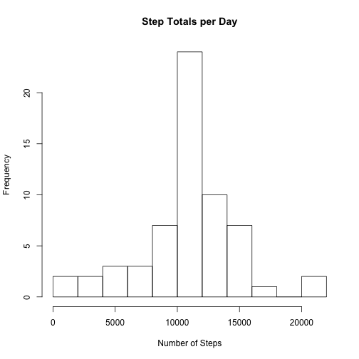
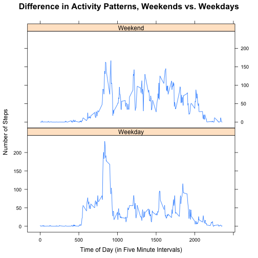

# Reproducible Research: Peer Assessment 1


## Loading and preprocessing the data
Load the data set into R and transform the steps and interval variables.

```r
activity <- read.csv("activity.csv")
activity$steps <- as.numeric(activity$steps)
activity$interval <- as.numeric(activity$interval)
activity$interval <- unique(activity$interval)
head(activity)
```

```
##   steps       date interval
## 1    NA 2012-10-01        0
## 2    NA 2012-10-01        5
## 3    NA 2012-10-01       10
## 4    NA 2012-10-01       15
## 5    NA 2012-10-01       20
## 6    NA 2012-10-01       25
```

## What is mean total number of steps taken per day?
Use the aggregaate() function to sum steps over unique dates. Then, create a histogram using the results aggregate function (sum total of steps per date). Then, determine the mean and median for number of steps per day of the sum total of steps per date.

```r
X <-aggregate(activity$steps ~ activity$date, data=activity, sum, na.rm=TRUE)
hist(X[,2], main="Step Totals per Day", xlab="Number of Steps", breaks=10)
```

 

```r
mean(X[,2])
```

```
## [1] 10766
```

```r
median(X[,2])
```

```
## [1] 10765
```

## What is the average daily activity pattern?
Use the aggregate() function again to find the mean number of steps taken per 5 minute intervals. Then, plot the mean number of steps per interval. 

```r
Y <-aggregate(activity$steps ~ activity$interval, data=activity, mean, na.rm=TRUE)

plot(Y[,2] ~ unique(activity$interval), type="l", ylab="Number of Steps", xlab="Time of Day (in Five Minute Intervals)", main="Average Number of Steps at Different Times of Day")
```

 

## Imputing missing values
First, determine the numbe of NAs in the activity dataframe. Then, create a new variable column in the activity dataframe, StepMeans (StepMeans is the mean number of steps taken per 5 minutes intervals determined above). Then, use a for() loop to replace the NA values in the steps variable with the mean number of steps for the corresponding 5 minute interval, updating the original activity dataframe. Finally, use the aggregate function to determine the sum total steps over unique dates in updated dataframe. Create a histogram and determine the mean and median number of steps per day based ont the results. Note that the updated dataframe (with NA values replaced) has the same mean number of steps per day as the original data, while the mean is almost exactly the same. This is not surprising, as the NA values were replaced with 5 minute interval averages taken from the original dataframe. 

```r
sum(is.na(activity$steps)) + sum(is.na(activity$interval)) + sum(is.na(activity$date))
```

```
## [1] 2304
```

```r
activity$StepMeans <- Y[,2]

for(i in 1:nrow(activity)){
  if (is.na(activity[i,1])) {
    activity[i,1] <- activity[i,4]
  }
}

head(activity)
```

```
##     steps       date interval StepMeans
## 1 1.71698 2012-10-01        0   1.71698
## 2 0.33962 2012-10-01        5   0.33962
## 3 0.13208 2012-10-01       10   0.13208
## 4 0.15094 2012-10-01       15   0.15094
## 5 0.07547 2012-10-01       20   0.07547
## 6 2.09434 2012-10-01       25   2.09434
```

```r
A <- aggregate(activity[,1] ~ activity[,2], data=activity, sum, na.rm=TRUE)

hist(A[,2], main="Step Totals per Day", xlab="Number of Steps", breaks=10)
```

 

```r
mean(A[,2])
```

```
## [1] 10766
```

```r
median(A[,2])
```

```
## [1] 10766
```

## Are there differences in activity patterns between weekdays and weekends?
Create a new variable, days, using the as.Date() and weekdays() function. Then, using the ifelse() function, create a two level factor variable that divides the days variable into weekdays or weekends. Finally, use lattice  to create a two panel plot showing how the number of steps taken per 5 minute intervals each day differs on weekdays and weekend days.

```r
activity$days <- weekdays(as.Date(activity$date))

activity$DayType <- ifelse(activity$days == "Monday" |  activity$days == "Tuesday" |
                    activity$days == "Wednesday" | activity$days == "Thursday" | 
                    activity$days == "Friday", c("Weekday"), c("Weekend"))

activity$DayType <- as.factor(activity$DayType)

library(lattice)

xyplot(activity$steps ~ activity$interval | activity$DayType, type="l", 
       ylab="Number of Steps", xlab="Time of Day (in Five Minute Intervals)",
       layout=c(1,2))
```

 
